<!--
AAKASH CHOUGULE — ULTIMATE GITHUB PROFILE
Important: keep the assets/ folder in this repository.
-->


 

  
  
  

  
  
  


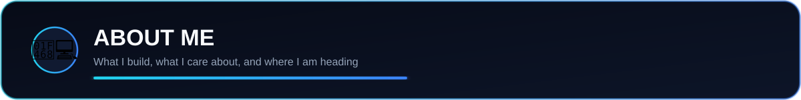

I'm Aakash Chougule, a .NET-focused software developer who enjoys building complete applications — from database design and backend logic to API security, frontend integration, testing and deployment.

My strongest focus is C#, ASP.NET Core, REST APIs, Entity Framework Core, SQL databases, authentication, authorization, business logic and maintainable backend architecture.

I also build modern frontend experiences using React.js, JavaScript, HTML, CSS, Bootstrap, Tailwind CSS and Vue.js.

⚡ Current focus

🔭 Building an Enterprise E-Commerce & Order Management System

🔐 Strengthening JWT authentication and role-based authorization

🧱 Practicing Clean / Layered Architecture

📨 Learning Apache Kafka and event-driven application design

🐳 Working with Docker and Docker Compose

🧪 Improving unit testing and integration testing

☁️ Learning Azure, AWS and CI/CD

🎯 Open to .NET Developer, Backend Developer and Full-Stack Developer roles

My engineering standard: make it work, understand why it works, make it maintainable, secure it, test it, then improve it.

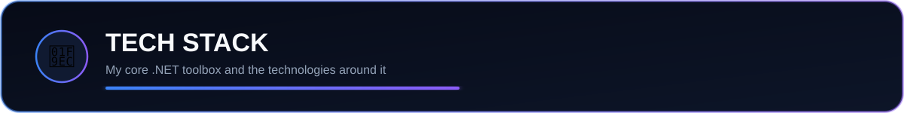

Core Stack

  

Data • Messaging • DevOps • Cloud

  

 

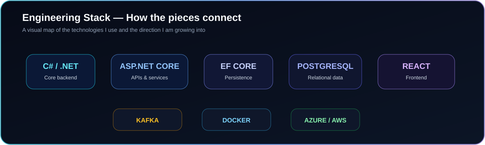

<b>🔎 Expand full engineering toolbox</b>

.NET / Backend

C# · .NET · ASP.NET Core · ASP.NET MVC · ASP.NET Web API · Web Forms · Windows Forms · Entity Framework Core · ADO.NET · LINQ · Dependency Injection · Repository Pattern · Service Layer · Middleware · DTOs · Validation

Data

PostgreSQL · Microsoft SQL Server · MySQL · SQL · Joins · Relationships · Indexes · Transactions · Stored Procedures · EF Core Migrations

Frontend

React.js · JavaScript · HTML5 · CSS3 · Bootstrap · Tailwind CSS · Vue.js · Responsive UI · REST API Integration

Engineering / DevOps

Apache Kafka · Docker · Docker Compose · Git · GitHub · Postman · Visual Studio · VS Code · CI/CD Concepts

Cloud — learning & deployment focus

Microsoft Azure · AWS

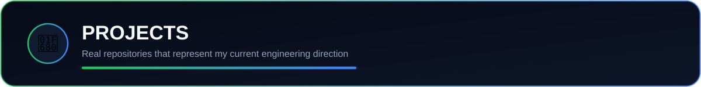

🛒 Enterprise E-Commerce & Order Management System

A production-minded full-stack e-commerce project built to practice real software engineering concepts instead of stopping at basic CRUD.

Highlights

JWT authentication and role-based authorization

Product, category and inventory management

Shopping cart and checkout

Order lifecycle

GST / CGST / SGST / IGST business rules

Razorpay payment flow and verification

Kafka-based notification architecture

Dockerized services

Unit and integration testing structure

React frontend connected to ASP.NET Core APIs

 

More selected repositories

Project

What it demonstrates

Repository

🎓 Student Management System API

ASP.NET Core Web API, CRUD, JWT, middleware, EF Core, SQL Server

Open

🤖 ChatBot API

.NET API development and container-ready setup

Open

🏪 Store Management System

C# business application and database CRUD workflows

Open

📦 Inventory Management System

ASP.NET / C# inventory and stock workflows

Open

<b>🧪 More repositories I've built</b>

🌦️ Weather App

🖼️ Image Converter

🎬 Embedded Video Converter

♟️ Chess with AI

🧑‍💻 Coding Wall Project

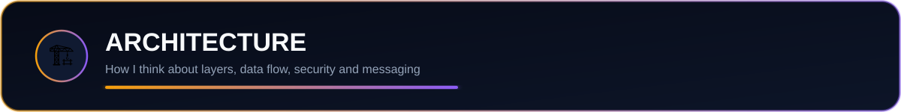

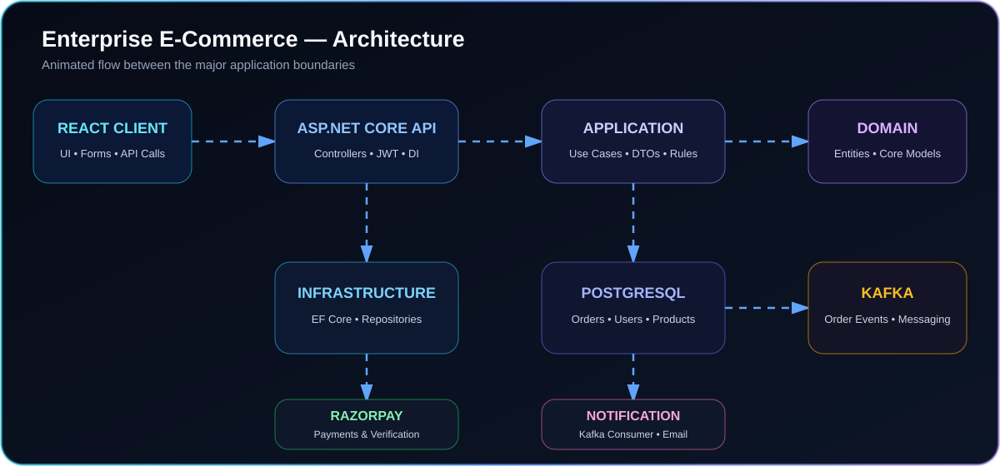

🔐 Security principles I care about

Password hashing instead of storing plain-text passwords

JWT-based authentication

Role-based authorization

Server-side validation

Secrets outside source control

Protected API endpoints

Proper HTTP status codes

Server-side payment verification

Global exception handling

Logging without exposing sensitive implementation details

🧠 Backend feature flow

HTTP Request
    ↓
Controller / Endpoint
    ↓
Validation
    ↓
Application Service
    ↓
Business Rules
    ↓
Repository / DbContext
    ↓
Database
    ↓
Response DTO
    ↓
HTTP Response

📨 Event-driven flow

Business Event
    ↓
ASP.NET Core API
    ↓
Kafka Producer
    ↓
Kafka Topic
    ↓
Consumer Service
    ↓
Notification / Email / Future Integrations

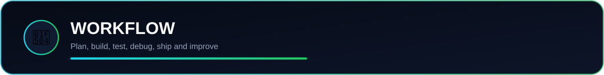

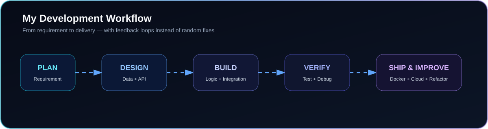

🐛 How I debug

REPRODUCE
    ↓
READ THE ERROR
    ↓
IDENTIFY THE FAILING LAYER
    ↓
CHECK REQUEST / LOGS / DATABASE
    ↓
ISOLATE ROOT CAUSE
    ↓
FIX
    ↓
RETEST THE COMPLETE FLOW

🧭 Engineering roadmap

C# → ASP.NET Core → REST APIs → EF Core + SQL → Security → Architecture → Testing → Kafka → Docker → CI/CD → Azure/AWS → System Design

👨‍💻 A little C# about me

public sealed class AakashChougule
{
    public string Role => ".NET Developer";

    public string MainStack =>
        "C# | ASP.NET Core | Web API | EF Core | SQL";

    public string[] Interests =>
    [
        "Backend Engineering",
        "REST API Design",
        "Clean Architecture",
        "Database Design",
        "Authentication & Authorization",
        "Apache Kafka",
        "Docker",
        "Cloud",
        "System Design"
    ];

    public void Work()
    {
        UnderstandRequirements();
        Design();
        Build();
        Test();
        Debug();
        Refactor();
        Ship();
        Learn();
    }
}

🐍 Contribution animation

The package includes .github/workflows/snake.yml.

Run that workflow once from the Actions tab. After it succeeds, uncomment this block:

<!--
<picture>
  <source media="(prefers-color-scheme: dark)" srcset="https://raw.githubusercontent.com/Aakash-Chougule/Aakash-Chougule/output/github-snake-dark.svg" />
  <source media="(prefers-color-scheme: light)" srcset="https://raw.githubusercontent.com/Aakash-Chougule/Aakash-Chougule/output/github-snake.svg" />
  
</picture>
-->

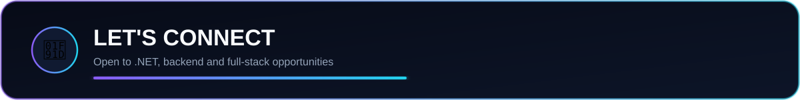

.NET Developer · Backend Developer · ASP.NET Core Developer · Full-Stack Developer

 

  

BUILD → TEST → DEBUG → LEARN → IMPROVE → REPEAT

